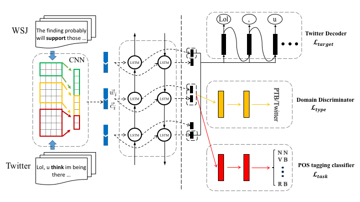

# POS Tagging for Twitter

TensorFlow implementation of [Part-of-Speech Tagging for Twitter with Adversarial Neural Networks](http://jkx.fudan.edu.cn/~qzhang/paper/emnlp2017.pdf). 



The code is partially referred to https://github.com/mkroutikov/tf-lstm-char-cnn and https://github.com/shucunt/domain_adaptation.

## Requirements

- Python 2.7 or higher
- Numpy 
- Tensorflow 1.0 
- Gensim

- In addition, anyone who want to run these codes should download the word embedding and the saved model from http://pan.baidu.com/s/1boSlljL. The folder 'word2vec' and the files 'adv_model...' should be placed at 'TPANN/.'.

## Usage

1.Reproducing the results of paper:
```
$ python adv_train.py --choice 0
```
which outputs dev_results.txt, test_results.txt and the accuracy of the model. Note that the model at the begnning might take a while reloading the parameters.

adv_model.ckpt contains the parameters of the model, which is to be used in the test time.

2.retraining the model 

Then, run
```
$ python adv_train.py --choice 1
```
which will save the parameters of the final model and output the wrong labels(dev_text.txt and test_text.txt).

The parameters in this model are: 

| params          | meaning                                           | default     |
|:---------------:|:-------------------------------------------------:|:-----------:|
| rnn_size        | size of LSTM internal state                       | 250         |
| kernels         | CNN kernel widths                                 | [1,2,3,4,5,6]|
| kernel_features | number of features in the CNN kernel              | [50,50,100,100,200,200]|
| adv_l           | meta-parameter λ in gradient reversal layer (GRL) | 0.7         |
| char_embed_size | dimensionality of character embeddings            | 25          |
| word_embed_size | dimensionality of word embeddings                 | 200         |
| max_word_length | maximum word length                               | 35          |
| param_init      | initialize parameters at                          | 0.05        |
| batch_size      | number of sequences to train on in parallel       | 20          |
| max_epochs      | number of full passes through the training data   | 100         |


You can change these values by passing the arguments explicitly. For example:
```
$ python adv_train.py --choice 1 --rnn_size 300 --adv_l 1 ...
```


## Reference

[Part-of-Speech Tagging for Twitter with Adversarial Neural Networks](http://jkx.fudan.edu.cn/~qzhang/paper/emnlp2017.pdf)


